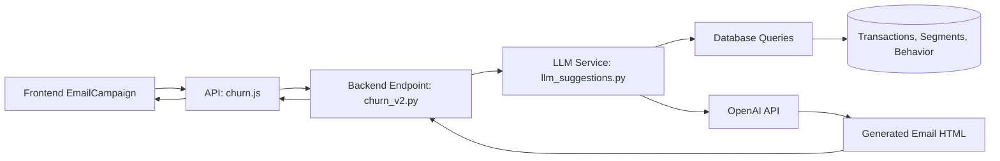

# LLM-Powered Personalized Email Generation

## Overview

This feature uses OpenAI's GPT-4o-mini to generate personalized retention emails based on customer churn risk analysis, transaction history, and behavior patterns.

## Implementation Date

December 3, 2025

## Architecture



## Components

### 1. Frontend Integration

**File:** `frontend/src/pages/EmailCampaign.jsx`

**Function:** `handleGeneratePersonalizedEmail` (lines 117-158)

**Features:**
- Triggered when user clicks "Generate Personalized Email" button
- Uses first selected customer for personalization
- Shows loading state during generation
- Updates email preview with generated content
- Handles errors gracefully with user-friendly alerts

**State Management:**
```javascript
const [generatingEmail, setGeneratingEmail] = useState(false)
```

### 2. API Client

**File:** `frontend/src/api/churn.js`

**Function:** `generatePersonalizedEmail` (lines 207-219)

**Endpoint:** `POST /churn/v2/organizations/{orgId}/customers/{customerId}/generate-personalized-email`

**Parameters:**
- `orgId`: Organization UUID
- `customerId`: External customer ID
- `churn_probability`: Float (0-1)
- `risk_level`: String (Low/Medium/High/Critical)

### 3. Backend Endpoint

**File:** `backend/app/api/v1/endpoints/churn_v2.py`

**Function:** `generate_customer_personalized_email` (lines 1012+)

**Request:**
```http
POST /churn/v2/organizations/{org_id}/customers/{customer_id}/generate-personalized-email
?churn_probability=0.75&risk_level=High
```

**Response:**
```json
{
  "success": true,
  "subject": "We Miss You! Special Offer Inside",
  "html_body": "<html>...</html>"
}
```

**Fallback Behavior:**
- If OPENAI_API_KEY is not set, returns default template
- If LLM generation fails, returns default template with `success: false`

### 4. LLM Service

**File:** `backend/app/services/behavior_analysis/llm_suggestions.py`

**Function:** `generate_personalized_email` (lines 16-127)

**Features:**
- Fetches customer transaction history (last 10 transactions)
- Retrieves customer segment data
- Retrieves behavior analysis (risk signals, recommendations)
- Constructs contextual prompt for OpenAI
- Uses GPT-4o-mini model with temperature 0.8 for creative output
- Enforces JSON response format
- 20-second timeout for API calls

**LLM Prompt Structure:**
1. Customer context (segment, behavior score, activity trends)
2. Risk signals and existing recommendations
3. Task instructions (tone, structure, CTA)
4. HTML template example
5. JSON output format specification

## HTML Email Template

The generated emails follow this structure:

```html
<html>
<body style="font-family: Arial, sans-serif; line-height: 1.6; color: #333; max-width: 600px; margin: 0 auto; padding: 20px;">
    <h2 style="color: #2c3e50;">Hello Valued Customer,</h2>
    <p>[Personalized opening based on their situation]</p>
    <p>[Acknowledge value and address concerns]</p>
    <div style="text-align: center; margin: 30px 0;">
        <a href="#" style="background-color: #3498db; color: white; padding: 12px 30px; text-decoration: none; border-radius: 5px; display: inline-block;">[Action Button Text]</a>
    </div>
    <p>[Closing with support offer]</p>
    <p style="color: #7f8c8d; font-size: 14px; margin-top: 30px;">
        Best regards,<br>
        The Team
    </p>
</body>
</html>
```

**Key Style Elements:**
- Max-width: 600px (email-safe)
- Inline CSS (email client compatibility)
- Clear CTA button with high contrast
- Professional color palette
- Responsive padding and spacing

## Configuration

### Environment Variables

**Required:**
```bash
OPENAI_API_KEY=sk-...
```

**Optional (defaults shown):**
```bash
LLM_MODEL=gpt-4o-mini
LLM_TEMPERATURE=0.8
LLM_TIMEOUT=20
```

## Usage Example

### From Frontend

```javascript
// Select customers and get first customer
const firstCustomer = customers.find(c => c.id === selectedCustomers[0])

// Generate personalized email
const result = await churnAPI.generatePersonalizedEmail(
  user.id,
  firstCustomer.id,
  parseFloat(firstCustomer.churn_score),
  firstCustomer.risk_segment
)

if (result.success) {
  // Update email preview
  setEmailPreview({
    subject: result.subject,
    html_body: result.html_body,
    text_body: result.html_body.replace(/<[^>]*>/g, '')
  })
}
```

### From Backend (Direct)

```python
from app.services.behavior_analysis.llm_suggestions import generate_personalized_email

result = generate_personalized_email(
    customer_id="CUST-12345",
    organization_id="org-uuid",
    churn_probability=0.75,
    risk_level="High",
    db=db_session
)

if result:
    print(f"Subject: {result['subject']}")
    print(f"Body: {result['html_body']}")
```

## Testing

### Manual Testing

1. **Start Backend:**
   ```bash
   cd backend
   uvicorn app.main:app --reload
   ```

2. **Set Environment Variable:**
   ```bash
   export OPENAI_API_KEY=sk-...
   ```

3. **Test via Frontend:**
   - Navigate to Email Campaign page
   - Select customers from prediction batch
   - Click "Generate Personalized Email"
   - Verify email preview shows generated content

4. **Test via API:**
   ```bash
   curl -X POST "http://localhost:8000/api/v1/churn/v2/organizations/{org_id}/customers/{customer_id}/generate-personalized-email?churn_probability=0.75&risk_level=High" \
     -H "Content-Type: application/json"
   ```

### Expected Behavior

**With OPENAI_API_KEY set:**
- ✅ Returns personalized email within 5-20 seconds
- ✅ Email subject is contextual and under 50 characters
- ✅ Email body references customer's risk level and patterns
- ✅ Email includes specific recommendations

**Without OPENAI_API_KEY:**
- ✅ Returns default template immediately
- ✅ Sets `success: false`
- ✅ Includes message about missing API key

## Performance Considerations

- **Response Time:** 5-20 seconds (depends on OpenAI API)
- **Cost:** ~$0.001 per email generation (GPT-4o-mini pricing)
- **Rate Limiting:** Subject to OpenAI API rate limits
- **Fallback:** Always provides default template if generation fails

## Future Enhancements

### Planned Features
- [ ] Batch email generation for multiple customers
- [ ] A/B testing different email templates
- [ ] Email preview with customer data substitution
- [ ] Custom template library
- [ ] Email performance tracking (open rates, click rates)
- [ ] Multi-language support
- [ ] Brand voice customization

### Optimization Opportunities
- [ ] Cache generated emails for similar customer profiles
- [ ] Pre-generate emails for high-risk customers
- [ ] Parallel processing for bulk generation
- [ ] Fine-tune custom model for faster generation

## Troubleshooting

### Issue: "Unable to generate personalized email"

**Cause:** OPENAI_API_KEY not set or invalid

**Solution:**
```bash
# Check if variable is set
echo $OPENAI_API_KEY

# Set variable
export OPENAI_API_KEY=sk-your-key-here

# Restart backend server
```

### Issue: Timeout errors

**Cause:** OpenAI API taking too long

**Solution:**
- Check OpenAI API status
- Increase timeout in `llm_suggestions.py`
- Use faster model (gpt-3.5-turbo)

### Issue: Generic or poor quality emails

**Cause:** Insufficient customer data

**Solution:**
- Ensure customer has transaction history
- Run behavior analysis before generating email
- Check segment assignment

## Related Features

- **Churn Reason Analysis:** `/analyze-churn-reason` endpoint
- **Behavior Analysis:** Provides context for email generation
- **Customer Segmentation:** Used to personalize email content
- **Email Campaign:** Main UI for sending emails

## Changelog

### December 3, 2025 - Initial Implementation
- ✅ Created backend endpoint in `churn_v2.py`
- ✅ Integrated with existing LLM service in `llm_suggestions.py`
- ✅ Frontend integration in `EmailCampaign.jsx`
- ✅ API client method in `churn.js`
- ✅ Documentation created

## References

- OpenAI API Documentation: https://platform.openai.com/docs
- Email HTML Best Practices: https://templates.mailchimp.com/
- Retention Email Strategies: Internal wiki

